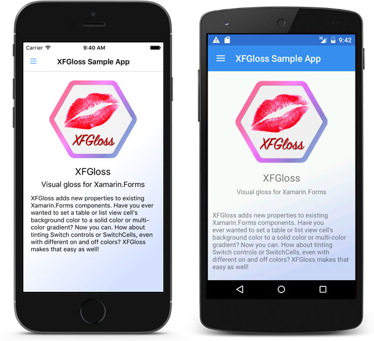
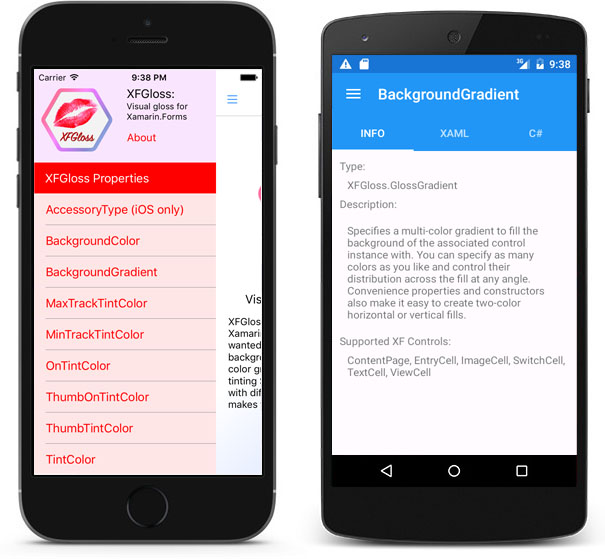

# XFGloss: Xamarin.Forms UI Enhancements

**XFGloss** adds new bindable properties to Xamarin.Forms standard UI components on the Android and iOS platforms. It uses attached bindable properties and enhanced renderers for the supported Xamarin.Forms UI components to work its magic. 

In the above screenshots, a gradient background was added to the bottom half of the XF ContentPage by adding this code to the Xaml declaration:

    <?xml version="1.0" encoding="UTF-8"?>
    <ContentPage	xmlns="http://xamarin.com/schemas/2014/forms"
    				xmlns:x="http://schemas.microsoft.com/winfx/2009/xaml"
    				xmlns:xfg="clr-namespace:XFGloss;assembly=XFGloss"
    				x:Class="XFGlossSample.Views.AboutPage"
    		 		Title="XFGloss Sample App" Padding="10"
    				>
    
    	<xfg:ContentPageGloss.BackgroundGradient>
    		<xfg:GlossGradient Angle="150">
    			<xfg:GlossGradient.Steps>
    				<xfg:GlossGradientStep StepColor="White" StepPercentage="0" />
    				<xfg:GlossGradientStep StepColor="White" StepPercentage=".5" />
    				<xfg:GlossGradientStep StepColor="#ccd9ff" StepPercentage="1" />
    			</xfg:GlossGradient.Steps>
    		</xfg:GlossGradient>
    	</xfg:ContentPageGloss.BackgroundGradient>
    ...
    </ContentPage>
    
XFGloss properties can also be constructed in code. Here's the C# equivalent for the above Xaml.

    namespace XFGlossSample.Views
    {
    	public class AboutPage : ContentPage
    	{
    		public AboutPage()
    		{
    			Title = "XFGloss Sample App";
    			Padding = 10;
    
    			var bkgrndGradient = new GlossGradient()
    			{
    				Angle = 150,
    				Steps = new List<GlossGradientStep>()
    				{
    					new GlossGradientStep(Color.White, 0),
    					new GlossGradientStep(Color.White, .5),
    					new GlossGradientStep(Color.FromHex("#ccd9ff"), 1)
    				}
    			};
    
    			ContentPageGloss.SetBackgroundGradient(this, bkgrndGradient);
    		}
    	}
    }
        
You can also instantiate an XFGloss instance to make multiple assignments easier. Note that the gloss instance doesn't have to be retained. It only provides convenient access to the static setters.

    // Create a XF Switch component and apply some gloss to it
    var onOffSwitch = new Switch();
    var gloss = new SwitchGloss(onOffSwitch);
    gloss.TintColor = Color.Red;
    gloss.ThumbTintColor = Color.Maroon;
    gloss.OnTintColor = Color.Green;
    gloss.ThumbOnTintColor = Color.Lime;
    
#Sample App

The XFGloss solution provided in this repository also includes the "XFGlossSample" Xamarin.Forms-based app. It demonstrates all the XFGloss properties being applied in both Xaml and C# code.

# Adding XFGloss to Your Xamarin.Forms Project

Integrating XFGloss into your XF-based app is easy. First, add the XFGloss NuGet to your app's PCL and Android/iOS platform projects. Next, initialize XFGloss from each of the platform projects like so:

**Android MainActivity.cs:**

    namespace XFGlossSample.Droid
    {
    	[Activity(Label = "XFGlossSample.Droid", Icon = "@drawable/icon", Theme = "@style/MyTheme", MainLauncher = true, ConfigurationChanges = ConfigChanges.ScreenSize | ConfigChanges.Orientation)]
    	public class MainActivity : global::Xamarin.Forms.Platform.Android.FormsAppCompatActivity
    	{
    		protected override void OnCreate(Bundle bundle)
    		{
    			TabLayoutResource = Resource.Layout.Tabbar;
    			ToolbarResource = Resource.Layout.Toolbar;
    
    			base.OnCreate(bundle);
    
    			global::Xamarin.Forms.Forms.Init(this, bundle);
    
    			/********** ADD THIS CALL TO INITIALIZE XFGloss *********/
				global::XFGloss.Droid.Library.Init(this, bundle);
    
    			LoadApplication(new App());
    		}
    	}
    }

**iOS AppDelegate.cs:**

    namespace XFGlossSample.iOS
    {
    	[Register("AppDelegate")]
    	public partial class AppDelegate : global::Xamarin.Forms.Platform.iOS.FormsApplicationDelegate
    	{
    		public override bool FinishedLaunching(UIApplication app, NSDictionary options)
    		{
    			global::Xamarin.Forms.Forms.Init();
    
    			/********** ADD THIS CALL TO INITIALIZE XFGloss *********/
    			global::XFGloss.iOS.Library.Init();
    
    			LoadApplication(new App());
    
    			return base.FinishedLaunching(app, options);
    		}
    	}
    }
    
# Using XFGloss with Other Custom Components

XFGloss should also work with existing custom components provided that the renderer is assigned to the custom component instead of a native XF component. Your **ExportRenderer** assembly attribute should look like this:

	[assembly: ExportRenderer(typeof(MyCustomSwitch), typeof(MyCustomSwitchRenderer))]

Instead of this:

	[assembly: ExportRenderer(typeof(Switch), typeof(MyCustomSwitchRenderer))]

To make XFGloss work with your custom component, change your custom renderers to inherit from the XFGloss renderers instead of the Xamarin.Forms renderers.

For example, change:

	public class MyCustomContentPageRenderer : PageRenderer
	{
	...
	}

To:

	public class MyCustomContentPageRenderer : XFGlossContentPageRenderer
	{
	...
	}

Here's a complete list of the XF renderers that are customized by XFGloss:

<table>
	<tr>
		<th>XF Renderer</th>
		<th>XFG Renderer</th>
	</tr>
	<tr>
		<td>EntryCellRenderer</td>
		<td>XFGlossEntryCellRenderer</td>
	</tr>
	<tr>
		<td>ImageCellRenderer</td>
		<td>XFGlossImageCellRenderer</td>
	</tr>
	<tr>
		<td>PageRenderer</td>
		<td>XFGlossContentPageRenderer</td>
	</tr>
	<tr>
		<td>SwitchRenderer</td>
		<td>XFGlossSwitchRenderer</td>
	</tr>
	<tr>
		<td>SwitchCellRenderer</td>
		<td>XFGlossSwitchCellRenderer</td>
	</tr>
	<tr>
		<td>TextCellRenderer</td>
		<td>XFGlossTextCellRenderer</td>
	</tr>
	<tr>
		<td>ViewCellRenderer</td>
		<td>XFGlossViewCellRenderer</td>
	</tr>
</table>

# XFGloss Properties

Some of the properties added by XFGloss already exist on some XF components. For example, the **BackgroundColor** property is available on many XF components. In such cases, XFGloss adds those properties to other XF components that didn't previously offer them. Other properties like the **BackgroundGradient** property are completely new to the XF environment.

---

**AccessoryType (iOS only):** XFGloss.CellGlossAccessoryType enum value  
_Added to EntryCell, ImageCell, TextCell and ViewCell_

Allows specifying the accessory type to be shown on the right side of the cell. Possible values are _None_, _DisclosureIndicator_, _Checkmark_ and _EditIndicator_. 

The Android platform doesn't offer accessory types as part of its standard UI, so this property isn't supported on Android devices.

The iOS _DetailButton_ and _DetailDisclosureButton_ accessory types aren't currently supported due to Xamarin.Forms' ListView component not allowing the external access needed to react to the user tapping the Details button. I plan to submit a PR that will address this, and will add support for those types to XFGloss once the needed access is available.

The XF TableView component provides the needed access, so I could add support for those accessory types for use with TableView if they are needed in the meantime. Please submit an issue if you would like the TableView-only property to be added before ListView also supports it.

**Code Examples:** [Xaml](https://github.com/tbaggett/xfgloss/blob/master/XFGlossSample/Examples/Views/Xaml/AccessoryTypePage.xaml), [C#](https://github.com/tbaggett/xfgloss/blob/master/XFGlossSample/Examples/Views/CSharp/AccessoryTypePage.cs)

---

**BackgroundColor:** Xamarin.Forms Color  
_Added to EntryCell, ImageCell, SwitchCell, TextCell and ViewCell_

Allows a color value to be specified as a cell's background color. Possible values are either named colors or numeric color values.

**Code Examples:** [Xaml](https://github.com/tbaggett/xfgloss/blob/master/XFGlossSample/Examples/Views/Xaml/BackgroundColorPage.xaml), [C#](https://github.com/tbaggett/xfgloss/blob/master/XFGlossSample/Examples/Views/CSharp/BackgroundColorPage.cs)

---

**BackgroundGradient:** XFGloss.GlossGradient  
_Added to ContentPage, EntryCell, ImageCell, SwitchCell, TextCell and ViewCell_

Allows a multiple-color linear gradient to be specified as a content page or cells' background. You can specify as many colors as you like and control their distribution across the fill at any angle. Convenience properties and constructors also make it easy to create two-color horizontal or vertical fills.

**Code Examples:** [Xaml](https://github.com/tbaggett/xfgloss/blob/master/XFGlossSample/Examples/Views/Xaml/BackgroundGradientPage.xaml), [C#](https://github.com/tbaggett/xfgloss/blob/master/XFGlossSample/Examples/Views/CSharp/BackgroundGradientPage.cs)

---

**OnTintColor:** Xamarin.Forms Color  
_Added to Switch and SwitchCell_

Allows a color value to be specified as the Switch control's track color when it is in the &quot;on&quot; position for the Switch and SwitchCell classes. Possible values are either named colors or numeric color values.

**Code Examples:** [Xaml](https://github.com/tbaggett/xfgloss/blob/master/XFGlossSample/Examples/Views/Xaml/OnTintColorPage.xaml), [C#](https://github.com/tbaggett/xfgloss/blob/master/XFGlossSample/Examples/Views/CSharp/OnTintColorPage.cs)

---
**ThumbOnTintColor:** Xamarin.Forms Color  
_Added to Switch and SwitchCell_

Allows a color value to be specified as the Switch control's thumb color when it is in the &quot;on&quot; position for the Switch and SwitchCell classes. Possible values are either named colors or numeric color values.

**Code Examples:** [Xaml](https://github.com/tbaggett/xfgloss/blob/master/XFGlossSample/Examples/Views/Xaml/ThumbOnTintColorPage.xaml), [C#](https://github.com/tbaggett/xfgloss/blob/master/XFGlossSample/Examples/Views/CSharp/ThumbOnTintColorPage.cs)

---

**ThumbTintColor:** Xamarin.Forms Color  
_Added to Switch and SwitchCell_

Allows a color value to be specified as the Switch control's thumb color when it is in the &quot;off&quot; position for the Switch and SwitchCell classes. Possible values are either named colors or numeric color values.

**Code Examples:** [Xaml](https://github.com/tbaggett/xfgloss/blob/master/XFGlossSample/Examples/Views/Xaml/ThumbTintColorPage.xaml), [C#](https://github.com/tbaggett/xfgloss/blob/master/XFGlossSample/Examples/Views/CSharp/ThumbTintColorPage.cs)

---

**TintColor:** Xamarin.Forms Color  
_Added to all cell classes' accessory types (iOS only), and the Switch and SwitchCell components (both platforms)_

Allows a color value to be specified as the Switch control's track color when it is in the &quot;off&quot; position for the Switch and SwitchCell classes, and for the accessory view on iOS. Possible values are either named colors or numeric color values.

**Code Examples:** [Xaml](https://github.com/tbaggett/xfgloss/blob/master/XFGlossSample/Examples/Views/Xaml/TintColorPage.xaml), [C#](https://github.com/tbaggett/xfgloss/blob/master/XFGlossSample/Examples/Views/CSharp/TintColorPage.cs)

#Known Issues

 - The default XF EntryCell renderer on iOS doesn't take the accessory view into account when positioning/sizing the text entry field. I plan to submit a PR that corrects this issue.

 - OnPlatform won't assign a value to an attached property when the binding is declared in Xaml **if Xaml compilation is enabled** ([verified issue by Xamarin](https://bugzilla.xamarin.com/show_bug.cgi?id=37371)). The workaround for this issue is to disable Xaml compilation for the Xaml files where you want to specify a binding for one of XFGloss's attached properties.  
Here's a code example taken from the verified issue that will fail when Xaml compilation is enabled:

        <Button>
        	<Grid.Row>
        		<OnPlatform x:TypeArguments="x:Int32" iOS="3" Android="0"/>
        	</Grid.Row>
        </Button>
        
# Future Enhancements
I plan to add support for other properties that aren't offered by the Xamarin.Forms components as my schedule allows. PRs, especially those that add support for other XF-supported platforms, are always welcomed!

# Credits
XFGloss was inspired by and based on the code presented in "[Lighting Up Native Platform Features In Xamarin Forms](http://www.wintellect.com/devcenter/krome/lighting-up-native-platform-features-in-xamarin-forms-part-1)." Thanks to the series' author, Keith Rome, for the inspiration and starting point for XFGloss.

# About the Author
I am a Xamarin Certified Mobile Developer focused on Android, iOS and tvOS application development using Microsoft tools and C#, and Apple tools and Swift.  I have 25+ years of professional software development experience and have successfully telecommuted on a variety of projects since 2008.

I am looking for opportunities to be part of a great team building great mobile apps! You can learn more about me on my [website](http://tommyb.com/) or [LinkedIn page](https://www.linkedin.com/in/tommybaggett).