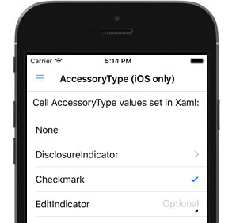
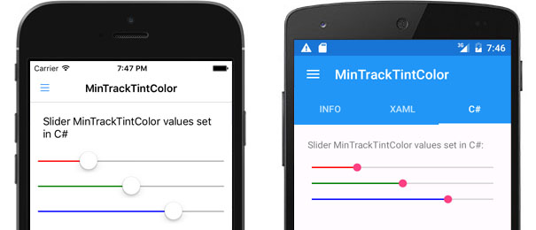
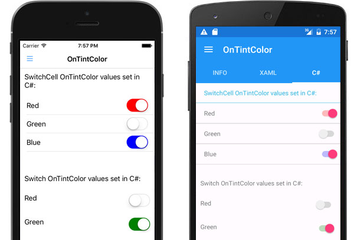
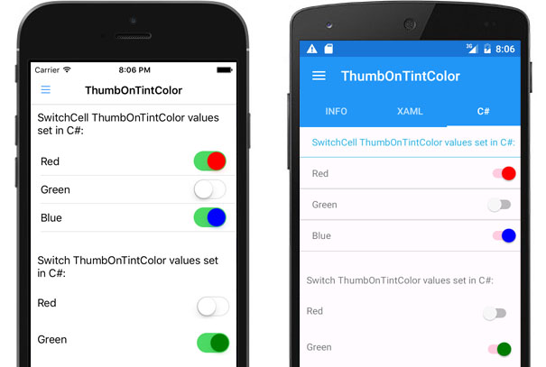
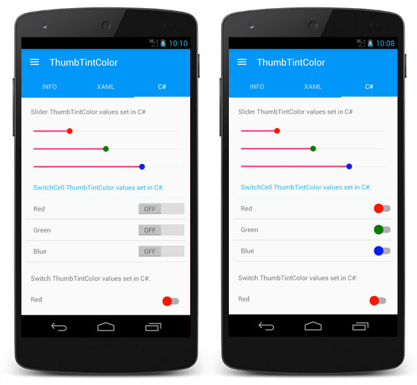

# XFGloss: Xamarin.Forms UI Enhancements


**XFGloss** adds new properties to the Xamarin.Forms standard UI components on the Android and iOS platforms. It uses attached bindable properties and enhanced platform-specific renderers to work its magic. More details are available ***here***.

Building XFGloss requires Visual Studio 2015 with update 3 installed on the Windows platform, or Xamarin Studio 6.0 on the Mac platform. A ***nuget package*** is also available for easy inclusion into your Xamarin.Forms projects.

In the above screenshots, a gradient background was added to the bottom half of the XF ContentPage by adding this code to the Xaml declaration:

```
<?xml version="1.0" encoding="UTF-8"?>
<ContentPage xmlns="http://xamarin.com/schemas/2014/forms"
             xmlns:x="http://schemas.microsoft.com/winfx/2009/xaml"
             xmlns:xfg="clr-namespace:XFGloss;assembly=XFGloss"
             x:Class="XFGlossSample.Views.AboutPage"
             Title="XFGloss Sample App" Padding="10"
             >
    
    <xfg:ContentPageGloss.BackgroundGradient>
        <xfg:Gradient Rotation="150">
            <xfg:GradientStep StepColor="White" StepPercentage="0" />
            <xfg:GradientStep StepColor="White" StepPercentage=".5" />
            <xfg:GradientStep StepColor="#ccd9ff" StepPercentage="1" />
        </xfg:Gradient>
    </xfg:ContentPageGloss.BackgroundGradient>
    ...
</ContentPage>
```
    
XFGloss properties can also be constructed in code. Here's the C# equivalent for the above Xaml.

```csharp
namespace XFGlossSample.Views
{
    public class AboutPage : ContentPage
    {
        public AboutPage()
        {
            Title = "XFGloss Sample App";
            Padding = 10;
    
			// Manually construct a multi-color gradient at an angle of our choosing
			var bkgrndGradient = new Gradient()
			{
				Rotation = 150,
				Steps = new GradientStepCollection()
				{
					new GradientStep(Color.White, 0),
					new GradientStep(Color.White, .5),
					new GradientStep(Color.FromHex("#ccd9ff"), 1)
				}
			};
    
            ContentPageGloss.SetBackgroundGradient(this, bkgrndGradient);
				
            Content = { ... }
        }
    }
}
```
        
You can also instantiate an XFGloss instance to make multiple assignments easier. Note that the gloss instance doesn't have to be retained. It only provides convenient access to the static setters.

```csharp
// Create a XF Switch component and apply some gloss to it
var onOffSwitch = new Switch();
var gloss = new SwitchGloss(onOffSwitch);
gloss.TintColor = Color.Red;
gloss.ThumbTintColor = Color.Maroon;
gloss.OnTintColor = Color.Green;
gloss.ThumbOnTintColor = Color.Lime;
```

---
    
#Sample App


The XFGloss solution provided in this repository also includes the "XFGlossSample" Xamarin.Forms-based app. It demonstrates all the XFGloss properties being applied in both Xaml and C# code.

---

# New/Enhanced Properties Provided by XFGloss

Some of the properties added by XFGloss already exist on some XF components. For example, the **BackgroundColor** property is available on many XF components. In such cases, XFGloss adds those properties to other XF components that didn't previously offer them. Other properties like the **BackgroundGradient** property are completely new to the XF environment.

Here's a brief description of the properties added/expanded by XFGloss:

---

###AccessoryType (iOS only)


**Type:** XFGloss.CellGlossAccessoryType enum value  
**Added to:** EntryCell, ImageCell, TextCell and ViewCell

Allows specifying the accessory type to be shown on the right side of the cell. Possible values are _None_, _DisclosureIndicator_, _Checkmark_ and _EditIndicator_. 

The Android platform doesn't offer accessory types as part of its standard UI, so this property is ignored on Android devices.

The iOS _DetailButton_ and _DetailDisclosureButton_ accessory types aren't currently supported due to Xamarin.Forms' ListView component not allowing the external access needed to react to the user tapping the Details button. I plan to submit a PR that will address this, and will add support for those types to XFGloss once the needed access is available.

The XF TableView component already provides the needed access, so I could add support for those accessory types for use with the TableView only if it is needed in the meantime. Please submit an issue if you would like the TableView-only property to be added before ListView also supports it.

**Xaml Example:**
```
<TextCell Text="DisclosureIndicator" xfg:CellGloss.AccessoryType="DisclosureIndicator" />
```

**C# Example:**
```csharp
var cell = new TextCell();
cell.Text = "DisclosureIndicator";
    
CellGloss.SetAccessoryType(cell, CellGlossAccessoryType.DisclosureIndicator);
```
    
**Sample App Code Excerpts:** [Xaml](https://github.com/tbaggett/xfgloss/blob/master/XFGlossSample/Examples/Views/Xaml/AccessoryTypePage.xaml), [C#](https://github.com/tbaggett/xfgloss/blob/master/XFGlossSample/Examples/Views/CSharp/AccessoryTypePage.cs)

---

###BackgroundColor


**Type:** Xamarin.Forms Color  
**Added to:** EntryCell, ImageCell, SwitchCell, TextCell and ViewCell

Allows a color value to be specified as a cell's background color. Possible values are either named colors or numeric color values.

**Xaml Example:**
```
<TextCell Text="Red" xfg:CellGloss.BackgroundColor="Red" />
```
**C# Example:**
```csharp
var cell = new TextCell();
cell.Text = "Red";
    
CellGloss.SetBackgroundColor(cell, Color.Red);
```

**Sample App Code Excerpts:** [Xaml](https://github.com/tbaggett/xfgloss/blob/master/XFGlossSample/Examples/Views/Xaml/BackgroundColorPage.xaml), [C#](https://github.com/tbaggett/xfgloss/blob/master/XFGlossSample/Examples/Views/CSharp/BackgroundColorPage.cs)

---

###BackgroundGradient


**Type:** XFGloss.Gradient  
**Added to:** ContentPage, EntryCell, ImageCell, SwitchCell, TextCell and ViewCell

Allows a multiple-color linear gradient to be specified as a content page or cells' background. You can specify as many colors as you like and control their distribution across the fill at any angle. Convenience properties and constructors also make it easy to create two-color horizontal or vertical fills.

**Xaml Example:**
```
<TextCell Text="Red" TextColor="White">
    <xfg:CellGloss.BackgroundGradient>
        <xfg:Gradient StartColor="Red" EndColor="Maroon" IsRotationTopToBottom="true" />
    </xfg:CellGloss.BackgroundGradient>
</TextCell>

<TextCell Text="All Three" TextColor="White" x:Name="rotatingCell">
    <!-- You can also create gradients at any angle with as many steps as you want. -->
    <xfg:CellGloss.BackgroundGradient>
        <xfg:Gradient Rotation="135" x:Name="rotatingGradient">
            <xfg:GradientStep StepColor="Red" StepPercentage="0" />
            <xfg:GradientStep StepColor="Maroon" StepPercentage=".25" />
            <xfg:GradientStep StepColor="Lime" StepPercentage=".4" />
            <xfg:GradientStep StepColor="Green" StepPercentage=".6" />
            <xfg:GradientStep StepColor="Blue" StepPercentage=".75" />
            <xfg:GradientStep StepColor="Navy" StepPercentage="1" />
        </xfg:Gradient>
    </xfg:CellGloss.BackgroundGradient>
</TextCell>
```

**C# Example:**
```csharp
var cell = new TextCell();
cell.Text = "Red";
cell.TextColor = Color.White;

CellGloss.SetBackgroundGradient(cell, new Gradient(Color.Red, Color.Maroon, Gradient.RotationTopToBottom));

// Manually construct a multi-color gradient at an angle of our choosing
var rotatingCell = new TextCell();
rotatingCell.Text = "All Three";
rotatingCell.TextColor = Color.White;

var rotatingGradient = new Gradient(135); // 135 degree angle
rotatingGradient.AddStep(Color.Red, 0);
rotatingGradient.AddStep(Color.Maroon, .25);
rotatingGradient.AddStep(Color.Lime, .4);
rotatingGradient.AddStep(Color.Green, .6);
rotatingGradient.AddStep(Color.Blue, .75);
rotatingGradient.AddStep(Color.Navy, 1);

CellGloss.SetBackgroundGradient(rotatingCell, rotatingGradient);
```

**Sample App Code Excerpts:** [Xaml](https://github.com/tbaggett/xfgloss/blob/master/XFGlossSample/Examples/Views/Xaml/BackgroundGradientPage.xaml), [C#](https://github.com/tbaggett/xfgloss/blob/master/XFGlossSample/Examples/Views/CSharp/BackgroundGradientPage.cs)

---

###MaxTrackTintColor


**Type:** Xamarin.Forms.Color  
**Added to:** Slider

Allows a color value to be specified for a Slider's right side of the track, beginning at the current thumb position. Possible values are either named colors or numeric color values.

**KNOWN ISSUE:** Modifying this property has no effect on an Android device running API 21 (Lollipop). Android's native support for this property is broken in that API level. This property works as expected on Android devices running all other API levels between 16 (Jelly Bean) and 23 (Marshmallow).

**Xaml Example:**
```
<Slider Minimum="0" Maximum="100" Value="25" xfg:SliderGloss.MaxTrackTintColor="Red" /> 
```
**C# Example:**
```csharp
var slider = new Slider { Minimum = 0, Maximum = 100, Value = 25 };
SliderGloss.SetMaxTrackTintColor(slider, Color.Red);
```
**Sample App Code Excerpts:** [Xaml](https://github.com/tbaggett/xfgloss/blob/master/XFGlossSample/Examples/Views/Xaml/MaxTrackTintColorPage.xaml), [C#](https://github.com/tbaggett/xfgloss/blob/master/XFGlossSample/Examples/Views/CSharp/MaxTrackTintColorPage.cs)

---

###MinTrackTintColor


**Type:** Xamarin.Forms.Color  
**Added to:** Slider

Allows a color value to be specified for a Slider's left side of the track, up to the current thumb position. Possible values are either named colors or numeric color values.

**KNOWN ISSUE:** Modifying this property causes both the left and right sides of the track's colors to be changed on Android devices running API 21 (Lollipop). Android's native support for this property was incorrectly implemented in that API level. This property works as expected on Android devices running all other API levels between 16 (Jelly Bean) and 23 (Marshmallow).

**Xaml Example:**
```
<Slider Minimum="0" Maximum="100" Value="25" xfg:SliderGloss.MinTrackTintColor="Red" /> 
```
**C# Example:**
```csharp
var slider = new Slider { Minimum = 0, Maximum = 100, Value = 25 };
SliderGloss.SetMinTrackTintColor(slider, Color.Red);
```
**Sample App Code Excerpts:** [Xaml](https://github.com/tbaggett/xfgloss/blob/master/XFGlossSample/Examples/Views/Xaml/MinTrackTintColorPage.xaml), [C#](https://github.com/tbaggett/xfgloss/blob/master/XFGlossSample/Examples/Views/CSharp/MinTrackTintColorPage.cs)

---

###OnTintColor


**Type:** Xamarin.Forms Color  
**Added to:** Switch and SwitchCell

Allows a color value to be specified as the Switch control's track color when it is in the &quot;on&quot; position for the Switch and SwitchCell classes. Possible values are either named colors or numeric color values.

**Xaml Example:**
```
<SwitchCell Text="Red" xfg:SwitchCellGloss.OnTintColor="Red" />

<Switch xfg:SwitchGloss.OnTintColor="Red" />
```
**C# Example:**
```csharp
var cell = new SwitchCell();
cell.Text = "Red";
SwitchCellGloss.SetOnTintColor(cell, Color.Red);

var switchCtrl = new Switch();
SwitchGloss.SetOnTintColor(switchCtrl, Color.Red);
```
**Sample App Code Excerpts:** [Xaml](https://github.com/tbaggett/xfgloss/blob/master/XFGlossSample/Examples/Views/Xaml/OnTintColorPage.xaml), [C#](https://github.com/tbaggett/xfgloss/blob/master/XFGlossSample/Examples/Views/CSharp/OnTintColorPage.cs)

---
###ThumbOnTintColor


**Type:** Xamarin.Forms Color  
**Added to:** Switch and SwitchCell

Allows a color value to be specified as the Switch control's thumb color when it is in the &quot;on&quot; position for the Switch and SwitchCell classes. Possible values are either named colors or numeric color values.

**Xaml Example:**
```
<SwitchCell Text="Red" xfg:SwitchCellGloss.ThumbOnTintColor="Red" />

<Switch xfg:SwitchGloss.ThumbOnTintColor="Red" />
```
**C# Example:**
```csharp
var cell = new SwitchCell();
cell.Text = "Red";
SwitchCellGloss.SetThumbOnTintColor(cell, Color.Red);

var switchCtrl = new Switch();
SwitchGloss.SetThumbOnTintColor(switchCtrl, Color.Red);
```
**Sample App Code Excerpts:** [Xaml](https://github.com/tbaggett/xfgloss/blob/master/XFGlossSample/Examples/Views/Xaml/ThumbOnTintColorPage.xaml), [C#](https://github.com/tbaggett/xfgloss/blob/master/XFGlossSample/Examples/Views/CSharp/ThumbOnTintColorPage.cs)

---

###ThumbTintColor


**Type:** Xamarin.Forms Color  
**Added to:** Slider, Switch and SwitchCell

Allows a color value to be specified as the Slider control's thumb color as well as the Switch control's thumb color when it is in the &quot;off&quot; position for the Switch and SwitchCell classes. Possible values are either named colors or numeric color values.

**Xaml Example:**
```
<SwitchCell Text="Red" xfg:SwitchCellGloss.ThumbTintColor="Red" />

<Switch xfg:SwitchGloss.ThumbTintColor="Red" />
```
**C# Example:**
```csharp
var cell = new SwitchCell();
cell.Text = "Red";
SwitchCellGloss.SetThumbTintColor(cell, Color.Red);

var switchCtrl = new Switch();
SwitchGloss.SetThumbTintColor(switchCtrl, Color.Red);
```
**Sample App Code Excerpts:** [Xaml](https://github.com/tbaggett/xfgloss/blob/master/XFGlossSample/Examples/Views/Xaml/ThumbTintColorPage.xaml), [C#](https://github.com/tbaggett/xfgloss/blob/master/XFGlossSample/Examples/Views/CSharp/ThumbTintColorPage.cs)

---

###TintColor


**Type:** Xamarin.Forms Color  
**Added to:** All cell classes' accessory types (iOS only), and the Switch and SwitchCell components (both platforms)

Allows a color value to be specified as the Switch control's track color when it is in the &quot;off&quot; position for the Switch and SwitchCell classes, and for the accessory view on iOS. Possible values are either named colors or numeric color values.

**Xaml Example:**
```
<TextCell Text="Red" xfg:CellGloss.TintColor="Red" xfg:CellGloss.AccessoryType="Checkmark" />

<SwitchCell Text="Red" xfg:CellGloss.TintColor="Red" />

<Switch xfg:SwitchGloss.TintColor="Red" />
```
**C# Example:**
```csharp
// iOS AccessoryType
var cell = new TextCell();
cell.Text = "Red";

var gloss = new CellGloss(cell);
gloss.TintColor = Color.Red;
gloss.AccessoryType = CellGlossAccessoryType.Checkmark;

// SwitchCell
var switchCell = new SwitchCell();
switchCell.Text = "Red";

CellGloss.SetTintColor(switchCell, Color.Red);

// Switch
var switchCtrl = new Switch();
SwitchGloss.SetTintColor(switchCtrl, Color.Red);
```
**Sample App Code Excerpts:** [Xaml](https://github.com/tbaggett/xfgloss/blob/master/XFGlossSample/Examples/Views/Xaml/TintColorPage.xaml), [C#](https://github.com/tbaggett/xfgloss/blob/master/XFGlossSample/Examples/Views/CSharp/TintColorPage.cs)

---

# Adding XFGloss to Your Xamarin.Forms-Based App

Integrating XFGloss into your XF-based app is easy. First, add the ***XFGloss NuGet package*** to your app's PCL and Android/iOS platform projects. Next, initialize XFGloss from each of the platform projects, like so:

**Android MainActivity.cs:**
```csharp
namespace XFGlossSample.Droid
{
    [Activity(Label = "XFGlossSample.Droid", Icon = "@drawable/icon", Theme = "@style/MyTheme", MainLauncher = true, ConfigurationChanges = ConfigChanges.ScreenSize | ConfigChanges.Orientation)]
    public class MainActivity : global::Xamarin.Forms.Platform.Android.FormsAppCompatActivity
    {
        protected override void OnCreate(Bundle bundle)
        {
            TabLayoutResource = Resource.Layout.Tabbar;
            ToolbarResource = Resource.Layout.Toolbar;
    
            base.OnCreate(bundle);
    
            Xamarin.Forms.Forms.Init(this, bundle);
    
            LoadApplication(new App());
            
            // IMPORTANT: Initialize XFGloss AFTER calling LoadApplication on the Android platform
            XFGloss.Droid.Library.Init(this, savedInstanceState);
        }
    }
}
```
**iOS AppDelegate.cs:**
```csharp
namespace XFGlossSample.iOS
{
    [Register("AppDelegate")]
    public partial class AppDelegate : global::Xamarin.Forms.Platform.iOS.FormsApplicationDelegate
    {
        public override bool FinishedLaunching(UIApplication app, NSDictionary options)
        {
            Xamarin.Forms.Forms.Init();
    
            /********** ADD THIS CALL TO INITIALIZE XFGloss *********/
            XFGloss.iOS.Library.Init();
    
            LoadApplication(new App());
    
            return base.FinishedLaunching(app, options);
        }
    }
}
```

Next, add a namespace entry to your Xaml files, or a using statement to your C# files, and start adding the new XFGloss properties to Xamarin.Forms components as demonstrated here and in the XFGlossSample app's source code.

XML namespace declaration needed in Xaml files:

	xmlns:xfg="clr-namespace:XFGloss;assembly=XFGloss"

Using statement needed in C# files:

	using XFGloss;

## Using XFGloss With the Android AppCompat Package
XFGloss has been tested with Android APIs 16 (Jellybean) through 23 (Marshmallow). The Android AppCompat library is required for Android devices running APIs prior to Marshmallow. In such cases, the XFGloss features that depend on the AppCompat library will fail gracefully if the application's main activity doesn't extend the XF FormsAppCompatActivity class.

XFGloss also provides a new SwitchCell renderer for the Android platform when using the AppCompat library. The new renderer utilizes the SwitchCompat component instead of the standard Android Switch control, resulting in a material design styled switch instead of the previous styling, as seen below.



*Default XF SwitchCell renderer running on Android Jellybean on the left, XFGloss SwitchCompat-based renderer on the right*

**This option can be disabled** if the previous styling is preferred. However, the custom XFGloss tinting properties will not be applied if the standard SwitchCell renderer is used.

To disable the use of the SwitchCompat-based renderer, set the *XFGloss.Droid.Library.UsingSwitchCompatCell* property to false **BEFORE** calling the Init method, like so:

**Android MainActivity.cs:**
```csharp
XFGloss.Droid.Library.UsingSwitchCompatCell = false;

// IMPORTANT: Initialize XFGloss AFTER calling LoadApplication on the Android platform
XFGloss.Droid.Library.Init(this, savedInstanceState);
```

---

# Using XFGloss with Other Custom XF Controls

XFGloss should work with existing custom XF controls provided that the following criteria is met.

## 1. The ExportRenderer Attribute Should Not Map to Existing XF Controls
The **ExportRenderer** attribute tells the XF framework what code should be executed to create and communicate with a platform-specific UI component when a given generic XF control is used. Most tutorials/examples of making custom XF components show a ExportRenderer attribute that maps a new generic XF control (the first typeof parameter in the attribute) to a new platform-specific renderer (the second typeof parameter). Your existing custom controls should work with XFGloss if that approach was used.

Existing custom controls with an ExportRenderer attribute like this should work:

<pre><code>[assembly: ExportRenderer(typeof(<b><font color="#0000ff">MyCustomSwitch</font></b>), typeof(MyCustomSwitchRenderer))]</code></pre>

A custom control won't be compatible with XFGloss if the ExportRenderer attribute maps a new custom renderer directly to an existing XF control. XFGloss uses this technique to enhance the stock controls instead of creating new custom ones. XFGloss must be the only case where custom renderers are mapped to standard XF controls. If there are multiple mappings to the same XF control, the last mapping to be processed at runtime is the only renderer that will be used.

Existing custom controls with an ExportRenderer attribute that maps directly to a stock XF control (the Switch control in this example) won't work:

<pre><code>[assembly: ExportRenderer(typeof(<b><font color="#ff0000">Switch</font></b>), typeof(MyCustomSwitchRenderer))]</code></pre>

## 2. Existing Renderers Should Inherit From XFGloss Renderers Where Applicable
To make XFGloss work with your custom component, change your custom renderers to inherit from the XFGloss renderers instead of the Xamarin.Forms renderers.

For example, change:  
```csharp
public class MyCustomContentPageRenderer : PageRenderer
{
...
}
```

To:
```csharp
public class MyCustomContentPageRenderer : XFGlossContentPageRenderer
{
...
}
```

A complete list of the XF renderers that are customized by XFGloss is provided below. Change existing custom renderers to inherit from the XFGloss renderer if its current base class is found in this list.

<table>
	<tr>
		<th>XF Renderer</th>
		<th>XFG Renderer</th>
		<th>XFG Renderer on Android API < 23 w/AppCompat
	</tr>
	<tr>
		<td>EntryCellRenderer</td>
		<td>XFGlossEntryCellRenderer</td>
		<td/>
	</tr>
	<tr>
		<td>ImageCellRenderer</td>
		<td>XFGlossImageCellRenderer</td>
		<td/>
	</tr>
	<tr>
		<td>PageRenderer*</td>
		<td>XFGlossContentPageRenderer</td>
		<td/>
	</tr>
	<tr>
		<td>SliderRenderer</td>
		<td>XFGlossSliderRenderer</td>
		<td/>
	<tr>
		<td>SwitchRenderer</td>
		<td>XFGlossSwitchRenderer</td>
		<td>XFGlossSwitchCompatRenderer</td>
	</tr>
	<tr>
		<td>SwitchCellRenderer</td>
		<td>XFGlossSwitchCellRenderer</td>
		<td>XFGlossSwitchCompatCellRenderer</td>
	</tr>
	<tr>
		<td>TextCellRenderer</td>
		<td>XFGlossTextCellRenderer</td>
		<td/>
	</tr>
	<tr>
		<td>ViewCellRenderer</td>
		<td>XFGlossViewCellRenderer</td>
		<td/>
	</tr>
</table>

\* PageRenderer inheritance should only be changed if the associated ExportRenderer attribute is mapping the XF ContentPage control to a custom renderer. Mapping the XF Page base class to custom renderers causes unstable behavior on the Android platform.

## 3. Existing Renderers Should Always Call the Base Class Versions of Overridden Methods

The XFGloss renderer classes require their overridden versions of OnElementChanged and OnElementPropertyChanged methods to be called, as well as other overridable methods and properties on a per-control basis. Verify your renderers are calling the base class implementations of any overridden methods and properties if XFGloss isn't working as expected.

---

#Known Issues

 - The default XF EntryCell renderer on iOS doesn't take the accessory view into account when positioning/sizing the text entry field. I plan to submit a PR that corrects this issue.

 - OnPlatform won't assign a value to an attached property when the binding is declared in Xaml **if Xaml compilation is enabled** ([verified issue by Xamarin](https://bugzilla.xamarin.com/show_bug.cgi?id=37371)). The workaround for this issue is to disable Xaml compilation for the Xaml files where you want to specify platform-specific binding. Here's a code example taken from the verified issue. The binding won't update when the app is executed if Xaml compilation is enabled.

        <Button>
        	<Grid.Row>
        		<OnPlatform x:TypeArguments="x:Int32" iOS="3" Android="0"/>
        	</Grid.Row>
        </Button>

---

# Future Enhancements
I plan to add support for other properties that aren't offered by the Xamarin.Forms components as my schedule allows. PRs, especially those that add support for other XF-supported platforms, are always welcomed!

---

# Credits
XFGloss was inspired by "[Lighting Up Native Platform Features In Xamarin Forms](http://www.wintellect.com/devcenter/krome/lighting-up-native-platform-features-in-xamarin-forms-part-1)." Thanks goes out to the series' author, [Keith Rome](https://twitter.com/keith_rome), for the inspiration and starting point for XFGloss.

Also, my skills with Xamarin were once again greatly improved this year by getting recertified as a [Xamarin Certified Mobile Developer](https://university.xamarin.com/certification) after having been originally certified in 2013. Here's a special shout out to some of my favorite XamU instructors, including [Glenn Stephens](https://twitter.com/glenntstephens), [Kym Phillpotts](https://twitter.com/kphillpotts) and [Judy McNeil](https://twitter.com/flyinggeekette)! They're all seasoned Xamarin developers and great instructors. Thanks to all of you and the other XamU instructors for the great training!

---

# License
The MIT License (MIT)

Copyright (c) 2016 Ansuria Solutions LLC & Tommy Baggett

Permission is hereby granted, free of charge, to any person obtaining a copy of this software and associated documentation files (the "Software"), to deal in the Software without restriction, including without limitation the rights to use, copy, modify, merge, publish, distribute, sublicense, and/or sell copies of the Software, and to permit persons to whom the Software is furnished to do so, subject to the following conditions:

The above copyright notice and this permission notice shall be included in all copies or substantial portions of the Software.

THE SOFTWARE IS PROVIDED "AS IS", WITHOUT WARRANTY OF ANY KIND, EXPRESS OR IMPLIED, INCLUDING BUT NOT LIMITED TO THE WARRANTIES OF MERCHANTABILITY, FITNESS FOR A PARTICULAR PURPOSE AND NONINFRINGEMENT. IN NO EVENT SHALL THE AUTHORS OR COPYRIGHT HOLDERS BE LIABLE FOR ANY CLAIM, DAMAGES OR OTHER LIABILITY, WHETHER IN AN ACTION OF CONTRACT, TORT OR OTHERWISE, ARISING FROM, OUT OF OR IN CONNECTION WITH THE SOFTWARE OR THE USE OR OTHER DEALINGS IN THE SOFTWARE.

---

# About the Author
I am a Xamarin Certified Mobile Developer focused on Android, iOS and tvOS application development using Microsoft tools and C#, and Apple tools and Swift.  I have 25+ years of professional software development experience and have successfully telecommuted on a variety of projects since 2008.

I am looking for opportunities to be part of a great team building great mobile apps! You can learn more about me on my [website](http://tommyb.com/) or [LinkedIn page](https://www.linkedin.com/in/tommybaggett).